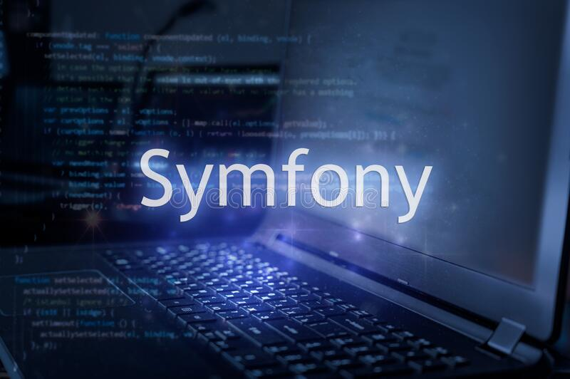

<p align="center">
  
</p>

# JOB-BOARD-API

REST API to handle job posts created to learn Symfony, Doctrine ORM, and API documentation with Swagger. This application covers topics such as Serialization, Swagger, Doctrine, Validation, PHPStan, PHP Codesniffer, and others.

## Requirements

- PHP 8.1
- [Composer](https://getcomposer.org/)
- [XAMPP](https://www.apachefriends.org/pt_br/index.html)
- [Symfony CLI](https://symfony.com/download) (optional)

## Install

1. Clone the repository:

   ```
   git clone https://gitlab.com/TiPhOoN/job-board-api.git
   ```

2. Access the directory:

   ```
   cd job-board-api
   ```

3. Install the Composer dependencies:

   ```
   composer install
   ```

4. Go to MySQL and create the database `job-board-api`.

5. Create a file `.env.local` and add your database connection. Example:
   ```dotenv
   DATABASE_URL="mysql://root:@localhost:3306/job-board-api"
   ```
6. Create the tables:

   ```
   php bin/console doctrine:migrations:migrate
   ```

7. Run the application:

   ```shell
   symfony server:start
   # or
   php -S localhost:8000 -t public
   ```

8. Go to http://localhost:8000

To generate the jwt keys, run the following command: `docker-compose run -it php-fpm php bin/console lexik:jwt:generate-keypair`.
## Routes
To access the API documentation, go to http://localhost:8000/api/doc.

## Quality Tools
You can run PHP codesniffer to check the code quality and PHPStan for static analysis.
### Code Style
Install PHP codesniffer:
```
composer require squizlabs/php_codesniffer
``` 
Run PHP codesniffer:
```
./vendor/bin/phpcs --standard=PSR12 src/
```

### Static Analyze
Install PHPStan:
```
composer require --dev phpstan/phpstan
``` 

Run PHPStan:
```
vendor/bin/phpstan analyse src
```
## Learn More
To know more about the development of Symfony applications, [check the official documentation](https://symfony.com/doc/current/index.html).